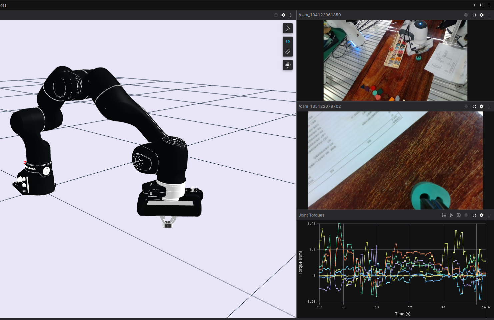

# Streaming Camera Data with Foxglove SDK
### This is part 1 of 3 in the Foxglove SDK beginner tutorial series.

## Introduction
The [Foxglove SDK](https://docs.foxglove.dev/docs/sdk/example) is built for rapid development and real-time visualization of robotics data—without requiring middleware like ROS. We understand that learning a new tool can be daunting compared to sticking with what is familiar, so in this beginner tutorial series we will show you step by step how to use the Foxglove SDK to visualize [the RH20T robot manipulator dataset](https://rh20t.github.io/) in just a few hours or less.



By following along with this tutorial series, you will be equipped with the tools necessary to vizualize:
 - Live or prerecorded camera feed
 - Intrinsic and extrinsic camera calibrations
 - A chain link robot manipulator
 - Scene transformations

## Step 1 – Install Dependancies
We will start this tutorial series by streaming video from a webcam and vizualizing it in an [image panel](https://docs.foxglove.dev/docs/visualization/panels/image). First, create a new python virtual environment.
For Linux and Mac:

```bash
python3 -m venv tutorial-venv 
source tutorial-venv/bin/activate
```
For Windows:
```bash
python -m venv tutorial-venv
tutorial-venv\Scripts\activate
```
Install all necessary dependancies. We will use [OpenCV](https://docs.opencv.org/4.x/d6/d00/tutorial_py_root.html) to process images.
```bash
pip install foxglove-sdk opencv-python
```
In a new python file, import Foxglove and the [RawImage](https://docs.foxglove.dev/docs/sdk/schemas/raw-image) message schema. Refer to the [SDK concepts](https://docs.foxglove.dev/docs/sdk/concepts) if you are unfamiliar with schemas and channels.


```python
import foxglove
import argparse
import cv2
import time
from foxglove.channels import RawImageChannel
from foxglove.schemas import RawImage, Timestamp
```

## Step 2 – Define a Camera Object

```python
class Camera:
    def __init__(self, cam):
        self.cam = cv2.VideoCapture(cam)
        self.name = f"cam{cam}"
        self.channel = RawImageChannel("/"+self.name)
```

## Step 3 – Stream and Save