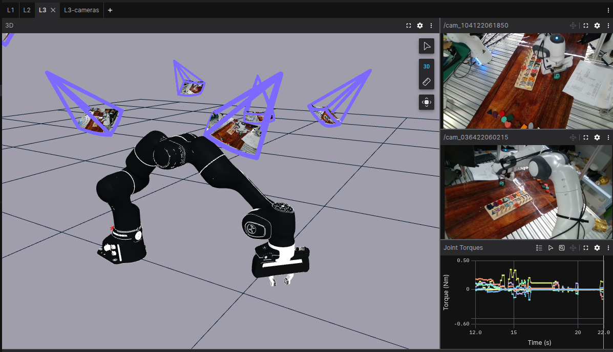

# Streaming Camera Data with Foxglove SDK
### This is part 1 of 3 in the Foxglove SDK beginner tutorial series.

## Introduction
The [Foxglove SDK](https://docs.foxglove.dev/docs/sdk/example) is built for rapid development and real-time visualization of robotics data—without requiring middleware like ROS. We understand that learning a new tool can be time consuming compared to sticking with what is familiar, so in this beginner tutorial series we will show you step by step how to use the Foxglove SDK to visualize [the RH20T robot manipulator dataset](https://rh20t.github.io/) in just a few hours or less.

By following along with this tutorial series, you will be equipped with the tools necessary to vizualize:
 - Live or prerecorded camera feed
 - Intrinsic and extrinsic camera calibrations
 - A chain link robot manipulator
 - Scene transformations



Part one of this tutorial series will be exploring how to create a live or prerecorded camera that can optionally be calibrated and positioned in a 3D environment. Lets get started! 

## Step 1 – Install Dependancies
We will start this tutorial series by streaming video from a webcam and vizualizing it in an [image panel](https://docs.foxglove.dev/docs/visualization/panels/image). First, clone this code's repository using git and create a new python virtual environment.
For Linux and Mac:

```bash
python3 -m venv tutorial-venv 
source tutorial-venv/bin/activate
python3 -m pip install --upgrade pip
```
For Windows:
```bash
python -m venv tutorial-venv
tutorial-venv\Scripts\activate
python -m pip install --upgrade pip
```
Install all necessary dependancies. We will use [OpenCV](https://docs.opencv.org/4.x/d6/d00/tutorial_py_root.html) to process images and transform3d to assist with frame transformations.
```bash

pip install foxglove-sdk opencv-python transforms3d
```

## The Basics of a Camera
In a new python file, import Foxglove relavent message schemas. We will use a RawImage schema to stream video data, a CameraCalibration schema to store intrinsic camera data, and finally a FrameTransform to store the camera's pose as a translation vector and orientation quaternion. Refer to the [SDK concepts](https://docs.foxglove.dev/docs/sdk/concepts) if you are unfamiliar with schemas and channels.


```python
import foxglove
import argparse
import cv2
import os
from foxglove.channels import RawImageChannel, CameraCalibrationChannel
from foxglove.schemas import RawImage, CameraCalibration, FrameTransform, Vector3, Quaternion, FrameTransforms
from transforms3d.quaternions import mat2quat
```

## Step 2 – Define a Camera Class
A straightforward way to iterate with sensors is to create a new object class with a unique message channel. All RawImage messages logged in the future will exist in this channel's namespace. This modular structure allows multiple sensors to be instantiated without message overlap during streaming.

```python
class Camera:
    def __init__(self, cam_idx, live=True):
        self.idx = cam_idx
        self.name = f"cam_{cam_idx}"
        self.channel = RawImageChannel("/"+self.name)
        self.calibration_channel = CameraCalibrationChannel("/"+self.name+"/info")

        if live:
            self.cam = cv2.VideoCapture(cam_idx) # Returns None if camera is not found
```
Next, we will implement a function to retrieve images from our camera, as well a function that streams images to the Foxglove interface. Although one function to handle both is sufficient, splitting will allow us to reuse the logging function when we preload a series of images later on. We will use an RGB camera for this example.

```python
    def get_img(self):
        ret, img = self.cam.read()
        if not ret: # Bad read, return None
            return None

        return img
```

```python
    def log_img(self, img, timestamp_nsec=None):
        width = img.shape[1]
        height = img.shape[0]

        img_msg = RawImage(
            frame_id=self.name,
            width=width,
            height=height,
            encoding="bgr8",
            step=width*3,
            data=img.tobytes(),
        )
        
        if timestamp_nsec is None:
            self.channel.log(img_msg) # Messages are logged with current time by default
        else:
            self.channel.log(img_msg, log_time=timestamp_nsec) 
```
The Foxglove SDK will automatically store the current time as the log timestamp (in nanoseconds) if not specified. Finally, it is good practice to close the camera after use.
```python
    def close(self):
        self.cam.release()
```
This is all the code needed to instantiate a basic camera in your environment that can be visualized in Foxglove. Let's now take a look at how to test that your camera is properly working.

## Step 3 – Stream and Save
Images can be streamed live to Foxglove or saved to an [MCAP file](https://mcap.dev/), which is a flexible and self-contained format that can record and replay Foxglove schemas, as well as Protobuf, DDS (CDR), ROS, and JSON messages. We will establish a live connection with Foxglove using `foxglove.start_server()` and create a new MCAP file to store the data for offline replay using `foxglove.open_mcap(<file name>)`

```python
if __name__ == "__main__":
    server = foxglove.start_server()
    writer = foxglove.open_mcap('cameras.mcap', allow_overwrite=True)
```
For our main loop, we specify which cameras we would like to connect to (idx = 0 is default) and sequentially log an image from each.
```python
    cam_indices = [0, 1, 2]  # Adjust camera indices as needed
    cams = [Camera(cam_indices[i]) for i in range(len(cam_indices))]

    print("Streaming data...")
    while True:
        try:
            for cam in cams:
                img = cam.get_img()
                if img is not None:
                    cam.log_img(img)

        except KeyboardInterrupt:
            print("Closing cameras")
            for cam in cams:
                cam.close()
            break
```
Open [Foxglove](https://app.foxglove.dev/) via the web or [desktop app](https://foxglove.dev/download) and see your camera stream live by opening a new websocket connection


Add an *Image Panel*, assign it the topic "/cam_0" by clicking the panel with the left sidebar open, and verify that your camera is properly being streamed!


## Step 4 – Calibrate Your Camera
It is often beneficial in robotics applications to know the location of a camera and how much it is distorting an image. 
```python
    def calibrate_mono_camera(self, M_in, M_ex, frame_width, frame_height, timestamp_nsec=None):
        """
        M_in: Intrinsic matrix as [K | 0]
        M_ex: Extrinsic matrix as [R_3x3, t_3x1; 0_1x3, 1]
        """
        
        K = M_in[:3, :3] # Calibration matrix
        P = np.concatenate((K, np.zeros((3, 1))), axis=1) # Projection matrix
        R_w = M_ex[:3, :3].T # Rotation matrix from world frame to camera frame
        t= M_ex[:3, 3] # Translation vector from camera frame to world frame
        c_w = -R_w @ t # Camera center in world frame
        q = mat2quat(R_w)

        camera_info = CameraCalibration(
            frame_id=self.name,
            width=frame_width,
            height=frame_height,
            P=P.flatten(),
            K=K.flatten(),
        )

        camera_transform = FrameTransform(
            parent_frame_id=WORLD_FRAME_ID,
            child_frame_id=self.name,
            translation=Vector3(x=float(c_w[0]), y=float(c_w[1]), z=float(c_w[2])),
            rotation=Quaternion(x=float(q[1]), y=float(q[2]), z=float(q[3]), w=float(q[0])),
        )
        
        if timestamp_nsec is None:
            self.calibration_channel.log(camera_info)
            foxglove.log("/tf", FrameTransforms(transforms=[camera_transform]))
        else:
            self.calibration_channel.log(camera_info, log_time=timestamp_nsec)
            foxglove.log("/tf", FrameTransforms(transforms=[camera_transform]), log_time=timestamp_nsec)
```

# Full Project Code
Test your cameras by running `python3 level_1.py -w cameras.mcap`


```python
import foxglove
import argparse
import cv2
import os
from foxglove.channels import RawImageChannel, CameraCalibrationChannel
from foxglove.schemas import RawImage, CameraCalibration, FrameTransform, Vector3, Quaternion, FrameTransforms
from transforms3d.quaternions import mat2quat
import numpy as np

WORLD_FRAME_ID = "world"

class Camera:
    def __init__(self, cam_idx, live=True):
        self.idx = cam_idx
        self.name = f"cam_{cam_idx}"
        self.channel = RawImageChannel("/"+self.name)
        self.calibration_channel = CameraCalibrationChannel("/"+self.name+"/info")

        if live:
            self.cam = cv2.VideoCapture(cam_idx) # Returns None if camera is not found

    def get_img(self):
        ret, img = self.cam.read()
        if not ret: # Bad read
            return None

        return img

    def log_img(self, img, timestamp_nsec=None):
        width = img.shape[1]
        height = img.shape[0]

        img_msg = RawImage(
            frame_id=self.name,
            width=width,
            height=height,
            encoding="bgr8",
            step=width*3,
            data=img.tobytes(),
        )
        
        if timestamp_nsec is None:
            self.channel.log(img_msg) # Messages are logged with current time by default
        else:
            self.channel.log(img_msg, log_time=timestamp_nsec)

    def load_imgs(self, img_dir):
        for img_file in os.listdir(img_dir):
            timestamp_ms = int(img_file.split(".")[0])
            timestamp_nsec = int(timestamp_ms * 1e6) # Make sure all timestamps are in nanoseconds
            img = cv2.imread(os.path.join(img_dir, img_file))
            self.log_img(img, timestamp_nsec)

    def calibrate_mono_camera(self, M_in, M_ex, frame_width, frame_height, timestamp_nsec=None):
        """
        M_in: Intrinsic matrix as [K | 0]
        M_ex: Extrinsic matrix as [R_3x3, t_3x1; 0_1x3, 1]
        """
        
        K = M_in[:3, :3] # Calibration matrix
        P = np.concatenate((K, np.zeros((3, 1))), axis=1) # Projection matrix
        R_w = M_ex[:3, :3].T # Rotation matrix from world frame to camera frame
        t= M_ex[:3, 3] # Translation vector from camera frame to world frame
        c_w = -R_w @ t # Camera center in world frame
        q = mat2quat(R_w)

        camera_info = CameraCalibration(
            frame_id=self.name,
            width=frame_width,
            height=frame_height,
            P=P.flatten(),
            K=K.flatten(),
        )

        camera_transform = FrameTransform(
            parent_frame_id=WORLD_FRAME_ID,
            child_frame_id=self.name,
            translation=Vector3(x=float(c_w[0]), y=float(c_w[1]), z=float(c_w[2])),
            rotation=Quaternion(x=float(q[1]), y=float(q[2]), z=float(q[3]), w=float(q[0])),
        )
        
        if timestamp_nsec is None:
            self.calibration_channel.log(camera_info)
            foxglove.log("/tf", FrameTransforms(transforms=[camera_transform]))
        else:
            self.calibration_channel.log(camera_info, log_time=timestamp_nsec)
            foxglove.log("/tf", FrameTransforms(transforms=[camera_transform]), log_time=timestamp_nsec)

    def close(self):
        self.cam.release()


if __name__ == "__main__":
    parser = argparse.ArgumentParser(description='Stream camera data')
    parser.add_argument('-w', '--write', type=str, default=None, help='MCAP save location')
    args = parser.parse_args()
    
    server = foxglove.start_server()
    if args.write is not None:
        writer = foxglove.open_mcap(args.write, allow_overwrite=True)

    cam_indices = [0, 1, 2]  # Adjust camera indices as needed
    cams = [Camera(cam_indices[i]) for i in range(len(cam_indices))]

    print("Streaming data...")
    while True:
        try:
            for cam in cams:
                img = cam.get_img()
                if img is not None:
                    cam.log_img(img)

        except KeyboardInterrupt:
            print("Closing cameras")
            for cam in cams:
                cam.close()
            break
```