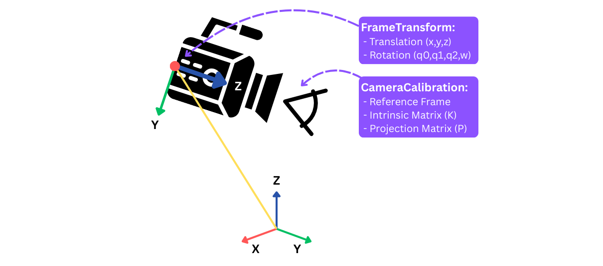

# Streaming Camera Data with Foxglove SDK
### This is part 1 of 3 in the Foxglove SDK beginner tutorial series.

## Introduction
The [Foxglove SDK](https://docs.foxglove.dev/docs/sdk/example) is built for rapid development and real-time visualization of robotics data—without requiring middleware like ROS. We understand that learning a new tool can be daunting compared to sticking with what is familiar, so in this beginner tutorial series we will show you step by step how to use the Foxglove SDK to visualize [the RH20T robot manipulator dataset](https://rh20t.github.io/) in just a few hours or less.

By following along with this tutorial series, you will be equipped with the tools necessary to vizualize:
 - Live or prerecorded camera feed
 - Intrinsic and extrinsic camera calibrations
 - A chain link robot manipulator
 - Scene transformations


Part one of this tutorial series will be exploring how to create either a live or prerecorded camera that can optionally be calibrated and positioned in a 3D environment. Lets get started! 

## Step 1 – Install Dependancies
We will start this tutorial series by streaming video from a webcam and vizualizing it in an [image panel](https://docs.foxglove.dev/docs/visualization/panels/image). First, clone this code's repository using git and create a new python virtual environment.
For Linux and Mac:

```bash
python3 -m venv tutorial-venv 
source tutorial-venv/bin/activate
python3 -m pip install --upgrade pip
```
For Windows:
```bash
python -m venv tutorial-venv
tutorial-venv\Scripts\activate
python -m pip install --upgrade pip
```
Install all necessary dependancies. We will use [OpenCV](https://docs.opencv.org/4.x/d6/d00/tutorial_py_root.html) to process images and transform3d to assist with frame transformations.
```bash

pip install foxglove-sdk opencv-python transforms3d
```

## Step 2 - The Basics of a Camera
In a new python file, import Foxglove relavent message schemas. We will use a RawImage schema to stream video data, a CameraCalibration schema to store intrinsic camera data, and finally a FrameTransform to store the camera's pose as a translation vector and orientation quaternion. Refer to the [SDK concepts](https://docs.foxglove.dev/docs/sdk/concepts) if you are unfamiliar with schemas and channels.




```python
import foxglove
import argparse
import cv2
import os
from foxglove.channels import RawImageChannel, CameraCalibrationChannel
from foxglove.schemas import RawImage, CameraCalibration, FrameTransform, Vector3, Quaternion, FrameTransforms
from transforms3d.quaternions import mat2quat
```

## Step 3 – Define a Camera Class
A straightforward way to iterate with sensors is to create a new object class with a unique message channel. All RawImage messages logged in the future will exist in this channel's namespace. This modular structure allows multiple sensors to be instantiated without message overlap during streaming.

```python
class Camera:
    def __init__(self, cam_idx, live=True):
        self.name = f"cam{cam_idx}"
        self.channel = RawImageChannel("/"+self.name)
        
        if live:
            self.cam = cv2.VideoCapture(cam_idx) # Returns None if camera is not found
```
Next, we will implement a function to retrieve images from our camera, as well a function to log the images. Although one function to handle both is sufficient, splitting will allow us to reuse the logging function when we preload a series of images later on.

```python
    def get_img(self):
        timestamp_sec = time.time()
        ret, img = self.cam.read()
        if not ret: # Bad read, return None
            return None, timestamp_sec

        return img, timestamp_sec
```
Every Foxglove schema requires a 

```python
    def log_img(self, img, timestamp_sec):
        width = img.shape[1]
        height = img.shape[0]

        timestamp_nsec = int((timestamp_sec - int(timestamp_sec)) * 1e9)
        
        img_msg = RawImage(
            timestamp=Timestamp(
                sec=int(timestamp_sec),
                nsec=int(timestamp_nsec),
            ),
            frame_id=self.name,
            width=width,
            height=height,
            encoding="bgr8",
            step=width*3,
            data=img.tobytes(),
        )
        self.channel.log(img_msg)
```

## Step 3 – Stream and Save